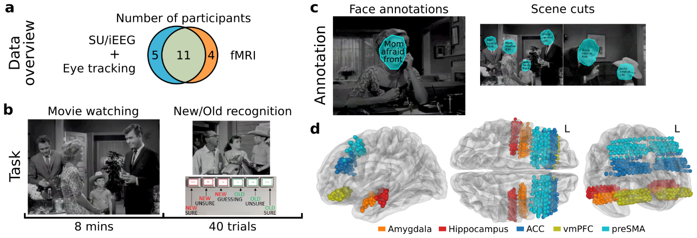

# Multimodal brain responses during movie watching: single-neuron, intracranial EEG, and fMRI in human patients

This repository contains Python scripts to accompany our data descriptor manuscript titled "Multimodal brain responses during movie watching: single-neuron, intracranial EEG, and fMRI in human patients". The code includes functionalities to read and plot data from NWB and BIDS files and perform various data validation analyses.

## Table of Contents
- [Introduction](#introduction)
    - [Data Formats](#data-formats)
- [Installation](#installation)
    - [Code](#code)
    - [Data](#data)
- [Usage](#usage)
- [Reference](#reference)
- [Funding](#funding)
- [License](#license)

## Introduction
This code accompanies the following data descriptor: [Citation Pending]. 

Abstract of the manuscript:
> We present a multimodal dataset of intracranial recordings, fMRI, and eye tracking in 20 human participants. Intracranial recordings consist of single neurons, local field potential, and intracranial EEG activity recorded concurrently from depth electrodes targeting the amygdala, hippocampus, and medial frontal cortex while participants underwent intracranial monitoring for localization of epileptic seizures. Participants watched an 8-min long movie ("Bang You're Dead") and performed a recognition memory test for movie content. 3T fMRI activity was recorded prior to surgery in 11 of the same participants while performing the same task. This NWB- and BIDS-formatted dataset includes the spike times of all neurons, field potential activity, behavior, eye tracking, electrode locations, demographics, and functional and structural MRI scans. For technical validation, we provide signal quality metrics, assess eye tracking quality, behavior, the tuning of cells and high-frequency broadband power field potentials to familiarity and event boundaries, and show brain-wide inter-subject correlations. This dataset will facilitate the investigation of brain activity during movie watching, recognition memory, and the neural basis of the fMRI-BOLD signal.



### Data Formats
The dataset is packaged in two standardized data formats: all data recorded while patients were being monitored with depth electrodes is provided in the Neural Data Without Borders (NWB) format, and all fMRI data is provided in the Brain Imaging Data Structure (BIDS) format.

- **NWB Files**: The NWB files are available from the Dandi Archive, under [Dandiset 000623](https://dandiarchive.org/dandiset/000623).

- **BIDS Files**: The BIDS files are available from the OpenNeuro platform, under OpenNeuro #XYZ. 

See below for information on how to download the dataset from Dandi and OpenNeuro.

## Installation
### Code
We recommend using Anaconda and a new environment to run the codes in this repository on a local machine. This will ensure that the necessary dependencies are installed and managed in a separate environment, without interfering with other Python projects that may have been installed. To get started, follow these steps:

- Install Anaconda or Miniconda by following the instructions on the official [website](https://www.anaconda.com/).

- Clone/download this repository to your local machine and navigate to the root directory of the repository in your terminal using the commands:
  ```bash
  git clone https://github.com/rutishauserlab/bmovie-release-NWB-BIDS
  cd bmovie-release-NWB-BIDS
  ```

- Create a new environment using the provided ‘make_env.yml’ file. This will create a new environment with the necessary dependencies installed. 
  ```bash
  conda env create --file make_env.yml
  ```

- Finally activate the environment to run the scripts provided in this repository:
  ```bash
  conda activate bmovietools
  ```

For more information on using Anaconda and conda environments, please refer to their official [documentation](https://docs.conda.io/projects/conda/en/latest/user-guide/tasks/manage-environments.html).


### Data
#### NWB Files: 
NWB-formatted intracranial recordings can be downloaded from the [Dandi Archive, Dandiset 000623](https://dandiarchive.org/dandiset/000623).

[Dandi command line interface (CLI)](https://pypi.org/project/dandi/) can be used to download the files from Dandi Archive using the commands:
```bash
dandi download DANDI:000623
```

#### BIDS Files:
BIDS-formatted fMRI data can be downloaded from the [OpenNeuro, dataset #XYZ](TOBEADDED).

[DataLad](https://www.datalad.org/) can be used to download the files from OpenNeuro using the commands:
```bash
datalad install https://github.com/OpenNeuroDatasets/[TOBEADDED]
```
Please refer to the [DataLad handbook](http://handbook.datalad.org/en/latest/) about how to use DataLad.


## Usage
Please note that the code snippets provided below make the following assumptions about file locations:
- NWB files are downloaded to a directory specified as `/path/to/nwb_files/`
- BIDS files are downloaded to a directory specified as `/path/to/bids_files/`
- BIDS files should be processed using fMRIprep, generating a derivatives directory located at `/path/to/fmriprep_directory/`

The input arguments in the scripts below will refer to these directories.

Run the script [`code/gen_table1_subj_info.py`](code/gen_table1_subj_info.py) to generate a table about the number of intracranial recording and fMRI runs performed, and patient demographics and pathology. This script reads the NWB files and BIDS sub-folder names to generate the table:
```bash
python gen_table1_subj_info.py --nwb_input_dir /path/to/nwb_files/ --bids_datadir /path/to/bids_files/
```

### Quality assurance analyses for intracranial recordings
To perform the quality assurance analyses for single-neuron and iEEG data, run the following scripts.

Run the script [`code/ephys_qc/gen_figure1d_electrodelocs.py`](code/ephys_qc/gen_figure1d_electrodelocs.py) to load NWB files to visualize recording locations across the patients in the template structural atlas MNI152NLin2009cAsym :
```bash
python gen_figure1d_electrodelocs.py --nwb_input_dir /path/to/nwb_files/
```

Please note that the script `gen_figure1d_electrodelocs.py` requires a full installation of MNE-Python with all dependencies to support 3D visualization. The installation steps provided above (based on `make_env.yml`) install only the the MNE-Python [with core dependencies](https://mne.tools/stable/install/manual_install.html#installing-mne-python-with-core-dependencies). To run this current script, one needs to follow MNE-Python's [advanced setup instructions](https://mne.tools/stable/install/manual_install.html#installing-mne-python-with-all-dependencies) to install all required dependencies. All other scripts in this repository are compatible with the *mne-base* package, which is already installed using the `make_env.yml` file.


Run the script [`code/ephys_qc/gen_figure2ah_singleunitQC.py`](code/ephys_qc/gen_figure2ah_singleunitQC.py) to load NWB files to plot the single-neuron spike sorting and recording quality assessment metrics:
```bash
python gen_figure2ah_singleunitQC.py --nwb_input_dir /path/to/nwb_files/
```

Run the script [`code/ephys_qc/gen_figure2i_recordinglocs.py`](code/ephys_qc/gen_figure2i_recordinglocs.py) to load NWB files to visualize recording locations in 2D on sagittal views of the template structural atlas MNI152NLin2009cAsym. 
:
```bash
python gen_figure2i_recordinglocs.py --nwb_input_dir /path/to/nwb_files/
```

Run the script [`code/ephys_qc/gen_figure3_eyetracking.py`](code/ephys_qc/gen_figure3_eyetracking.py) to load NWB files to plot eye tracking data quality:
```bash
python gen_figure3_eyetracking.py --nwb_input_dir /path/to/nwb_files/
```

Run the script [`code/ephys_qc/gen_figure3_recogtask_roc.py`](code/ephys_qc/gen_figure3_recogtask_roc.py) to load NWB files to plot behavioral ROC curves for recognition task for the intracranial recording sessions: 
```bash
python gen_figure3_recogtask_roc.py --nwb_input_dir /path/to/nwb_files/
```

#### Memory selective neurons and channels
To examine the ratio of memory selective neurons and plot responses from two sample neurons, run the script [`code/ephys_qc/singleneuron/examine_neurons_recognitiontask.py`](code/ephys_qc/singleneuron/examine_neurons_recognitiontask.py):
```bash
python examine_neurons_recognitiontask.py --nwb_input_dir /path/to/nwb_files/ 
```

To examine the ratio of memory selective channels (from macroelectrodes or microwires) and plot responses from two sample channels, run the script [code/ephys_qc/ieeg/examine_channels_recognitiontask.py](code/ephys_qc/ieeg/examine_channels_recognitiontask.py):
```bash
python examine_channels_recognitiontask.py --nwb_input_dir /path/to/nwb_files/ --lfp_process_dir /path/to/lfp_prep_dir
```

Note that data from both microwires and macroelectrodes must undergo preprocessing to obtain the high-frequency broadband (HFB) time-course for each channel. This preprocessing should be completed before running the data quality validation script `examine_channels_recognitiontask`.py. To perform this preprocessing for both types of electrodes, run the script [code/ephys_qc/ieeg/prep_filterLFP.py](code/ephys_qc/ieeg/prep_filterLFP.py):
```bash
python prep_filterLFP.py --nwb_input_dir /path/to/nwb_files/ --lfp_process_dir /path/to/lfp_prep_dir
```

#### Memory event neurons and channels
To examine the ratio of event selective neurons and plot responses from two sample neurons, run the script [`code/ephys_qc/singleneuron/examine_neurons_scenecuts.py`](code/ephys_qc/singleneuron/examine_neurons_scenecuts.py):
```bash
python examine_neurons_scenecuts.py --nwb_input_dir /path/to/nwb_files/ --scenecuts_file /path/to/scenecut_info.csv
```
Note that a copy of the CSV file `scenecut_info.csv` containing information about scene cuts in the movie stimuli can be found in the folder [`code/ephys_qc/singleneuron`](code/ephys_qc/singleneuron/).

To examine the ratio of event selective channels (from macroelectrodes or microwires) and plot responses from two sample channels, run the script [code/ephys_qc/ieeg/examine_channels_scenecuts.py](code/ephys_qc/ieeg/examine_channels_scenecuts.py):
```bash
python examine_channels_scenecuts.py --nwb_input_dir /path/to/nwb_files/ --lfp_process_dir /path/to/lfp_prep_dir --scenecuts_file /path/to/scenecut_info_file
```

### Quality assurance analyses for fMRI data
To load fMRIprep-processed data to compute framewise displacement for each participant, run the script [`code/fmri_qc/gen_figure4a_framewisedisp.py`](code/fmri_qc/gen_figure4a_framewisedisp.py)
```bash
python gen_figure4a_framewisedisp.py --fmriprep_dir /path/to/fmriprep_directory/
```

To assess fMRI data quality, voxel-wise temporal signal-to-noise ratio (tSNR) values were computed.
- To compute tSNR values in each participant's native space, run the script [`code/fmri_qc/compute-tsnr-volume.py`](code/fmri_qc/compute-tsnr-volume.py)
    ```bash
    python compute-tsnr-volume.py --fmriprep_dir /path/to/fmriprep_directory/ --output_dir /path/to/tsnr_prep_dir
    ```
    Then, run the script [code/fmri_qc/gen_figure4b_tsnr-nativeviolin.py](code/fmri_qc/gen_figure4b_tsnr-nativeviolin.py) to load precomputed volumetric tSNR values to show in a violin plot across participants.
    ```bash
    python gen_figure4b_tsnr-nativeviolin.py --fmriprep_dir /path/to/fmriprep_directory/ --tsnr_datadir /path/to/tsnr_prep_dir
    ```

- To compute tSNR values after spatially normalizing participant-specific images to the fsaverage template, run the script [`code/fmri_qc/compute-tsnr-fsaverage.py`](code/fmri_qc/compute-tsnr-fsaverage.py):
    ```bash
    python compute-tsnr-fsaverage.py --fmriprep_dir /path/to/fmriprep_directory/ --output_dir /path/to/tsnr_prep_dir
    ```    
    Then, run the script [`code/fmri_qc/gen_figure4c_tsnr-fsaverage.py`](code/fmri_qc/gen_figure4c_tsnr-fsaverage.py) to load precomputed tSNR values to show on fsaverage template using the [pycortex](https://gallantlab.org/pycortex/) library.
    ```bash
    python gen_figure4c_tsnr-fsaverage.py --tsnr_datadir /path/to/tsnr_prep_dir
    ```

Inter-subject correlation (ISC) was computed to compare the activation patterns across participants. The scripts [code/fmri_qc/prepdata-isc-fsaverage.py](code/fmri_qc/prepdata-isc-fsaverage.py) and [code/fmri_qc/compute-isc-fsaverage.py](code/fmri_qc/compute-isc-fsaverage.py) can be used compute ISC on data projected to fsaverage, after denoising data (as implemented in budapestcode.utils.clean_data). 
```bash
python prepdata-isc-fsaverage.py --fmriprep_dir /path/to/fmriprep_directory/ --isc_outdir /path/to/isc_prepdata_directory/
python compute-isc-fsaverage.py --isc_datadir /path/to/isc_prepdata_directory/
```

Then, the mean ISC across subjects can be plotted with the [pycortex](https://gallantlab.org/pycortex/) library by running the script [code/fmri_qc/gen_figure5_isc-fsaverage.py](code/fmri_qc/gen_figure5_isc-fsaverage.py):
```bash
python gen_figure5_isc-fsaverage.py --corrs_data_file /path/to/corrs_data_file
```

For further details on computations, input parameters, and output arguments, please refer to the comments or documentation provided within the Python scripts.

## Reference
If you use this code or the associated data, please cite:
- Citation pending

## Funding
Acquisition of the associated data was supported by the NIMH Caltech Conte Center (P50MH094258 to R.A.), the BRAIN initiative through the National Institute of Neurological Disorders and Stroke (U01NS117839 to U.R.), and the Simons Collaboration on the Global Brain (542941 to R.A. and U.R.).

## License
This repository is released under the BSD 3-Clause license. See the [LICENSE](LICENSE) file for details.

